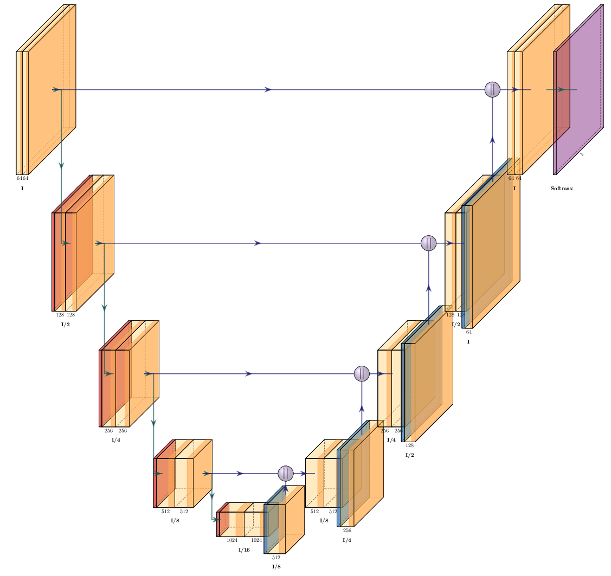

#  Module3: Deep Learning

Deep learning is a type of machine learning, loosely inspired by biological neural networks, that uses multiple layers of artificial neurons to perform a task.  

## Convolutional Neural Networks

A subset of deep learning is Convolutional Neural Networks (CNN).  In a CNN each layer usually consists of some of the following operations

1.  Convolution layers - multiple convolutions are performed between the input signal and kernels.
2.  Activation layer - An optional nonlinear activation function is performed on the output of step 1. 
3.  Downsampling (pooling) or Upsampling (transposed convolution) layers

A popular convolutional neural network architecture is the unet.  Which consists of a series of convolution layers followed by downsampling (pooling) which reduce the dimensions of the signal but increase the number of channels, and then a series of transposed convolutional layers which increase the spatial resolution until it is the same as the input. 

<figure>
  
  <figcaption>U-Net Architecture</figcaption>
</figure>

## Types of tasks in deep learning for image analysis

1.  Instance Segmentation - Identify and label individual objects
2.  Semantic Segmentation - Label each pixel as belonging to one of several predefined classes (such as background, car, dog, etc.)
3.  Image-to-Image transformation - Transform one image into another (image restoration, image denoising, super resolution)

##  Relationship between Deep Learning and Deconvolution

Deconvolution can be thought of as a type of Image-to-Image transformation where we use a single convolution kernel (the PSF) in a single pass equation (Inverse of Wiener Filter) or iterative update formula (Richardson Lucy).  In the case where we extract the PSF from a bead image using the known positions of the beads, we can see the relationship with machine learning (we 'learned' the PSF assuming a ground truth and model).

In deep learning restoration with unet instead of using a single large kernel (the PSF) we use multiple smaller kernels combined with pooling layers, then multiple upsampling layers to produce the restored image.  The pooling layers are needed so that the network has a large enough receptive field to handle blur with large spatial extent. 

In order to train a unet for image restoration we need ground truths, there are many strategies some outline [here](https://www.nature.com/articles/s41592-018-0216-7).

For this tutorial we will simulated image to create ground truths.  

## Relationship between Instance Segmentation and Deconvolution

One of the main reasons we deconvolve is to increase contrast in the image in order to get better downstream measurements and (hopefully) better downstream science.  If the end goal is to get better measurements then we may be able to replace the Deconvolution + Classical Object Segmentation steps in an image pipeline with a single convolutional neural network trained for instance segmentation.   It may be easier to generate training sets for instance segmentation then for Image-to-image transformation.  For example it can be difficult to produce ground truth 'true' image intensities, but on the other-hand a human can label the location and outlines of objects, even in a blurry and noisy image, 

## CSB Deep CARE and Stardist

CSB Deep is a popular high level framework that makes it (relatively) easy to train convolutional neural networks for biological applications.   

In this tutorial we will use two subsets of CSBDeep, [CARE](https://csbdeep.bioimagecomputing.com/tools/care/) for image-to-image transformations and [Stardist](https://github.com/stardist/stardist) for instance segmentaton. 
